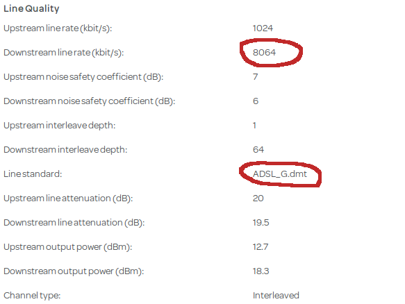

Talktalk problem report
=======================

**Background**: Existing Essentials contract with simple broadband expired
on 10th Dec 2015. Renewed to Fibre Broadband (medium), with go-live date
of 30th Dec.

* 30th Dec: phone line goes dead at midday, does not return.

* 31st Dec: reported issue under call ref. **INC000012924959**.

* 2nd Jan: Openreach engineer attended, restored phone. Router initiated
  VDSL connection but no Internet service present (red light). Reported
issue again: told connection hasn't been activated.

* 3rd Jan: chased again, told waiting for more work by Openreach. No ETA.

* 5th Jan: told to expect update from case manager tomorrow.

* 6th Jan: Case manager called home line while I was at work and was
forcibly referred to my mobile number by partner (after suggesting that
we call back). Said installation was delayed as Openreach hadn't been
able to complete it. Expected Openreach work to complete on 14th Jan but
would call with update on 11th. Repeatedly said, "do not be worried" when
told this delay was unacceptable and pressed for a firm delivery date.

* 7th Jan: Unable to claim the 'free upgrade' offered by Talktalk in
compensation for the hack and data loss that occurred to them back in
October 2015. Online account, when I was finally able to access it
remotely, said it couldn't be claimed until "your existing orders are
processed" and was unable to complete the transaction on the phone due to
the wait times (including queuing for customer support and then their
mobile team).

* 8th Jan: Internet service resumed at 4pm without notice but router
  showing ADSL\_g.dmt connection only with 8Mbps line speed (~3Mbps actual).
Connection became unusably slow from around 9pm; this pattern has
continued since.

* 13th Jan: Chased with Talktalk. Advised that case was closed as testing
  showed that the line was up and router was connected. Line speed showing
as 28-30Mbps. Was asked to try swapping microfilter and using master
socket (wasn't at home to test).

* 16th Jan: tested as advised, no difference. Line now reaches maximum of
  6Mbps but varies widely and often interrupted, becoming unusably slow in
evenings. Rang Talktalk and followed automated prompts but informed that
their systems were down for maintenance and they were unable to log calls.
By 8pm, line speed drops to < 1Mbps typical, as usual.

* 18th Jan: rang TT customer service again. Informed that fibre broadband still
showing as not activated (note that this directly contradicts what I was told
during call on 13th). Passed to Billing team who escalated the issue; told that
an email would be sent in the next 24-48 hours with an activation date.
Updated mobile number on contact details for future reference.

* 19th Jan: @talktalkcare told me that my order was still showing as delayed
because Openreach were unable to complete the installation. TT Case Manager
will contact me on 21st with an update. (Note that this is almost word for
word a repeat of information last given on 6th.)

* 21st Jan: Case manager called mobile at 10:30, was cut off for unknown reason
shortly after and has not attempted to call back.  
Meanwhile, the stability of the existing ADSL connection has improved of late,
and its performance no longer seems to stutter and die in the evenings.
Email from Talktalk CEO's office promising a call tomorrow to discuss.

* 22nd Jan: Waited until 3pm then rang Talktalk CEO's office number; left
voicemail.  
Checking router again now shows an ADSL2+ line standard with 11515
download/1020 upload (~9Mbps effective from speed test) since a day and a
half ago, which may explain why the connection has stabilised. Still not
VDSL though.  
Here's a [classic example](https://community.talktalk.co.uk/t5/Superpowered-Fibre-Broadband/HG633-No-option-for-VDSL-Only-ADSL2/td-p/1803452)
of the joys of trying to get TT fibre broadband.

* 29th Jan: Call from CEO's office. Explained that our local cabinet could
not be provisioned due to capacity issues, and that Openreach had since been
updating the call weekly with only a note to "review". Talktalk are escalating
this to their "CEO provisioning team" (presumably UK-based) to chase due to the
delay. TT will make a 'gesture' as compensation once provisioning is completed.
It was an extensive and useful update; a shame this couldn't have been provided
from the start.  
Meanwhile, on a related note, a [story](http://itsecurity.co.uk/2016/01/3723/)
broke yesterday about call centre workers being arrested at Talktalk's support
parter Wipro in India. (The comments on the Register piece are also illuminating.)
This confirms my feeling that not only is Wipro's work often poor, they're
an active risk to Talktalk's customer base.  
Also further [ongoing rumblings](http://zelo-street.blogspot.co.uk/2016/01/shapps-murdoch-grovel-rumbled.html),
albeit partisan, about hiving off Openreach from BT, which
looks worth serious consideration but not if it's just to give it
to Sky. (Again, see comments on that post too.)

* 4th Feb: Update call from CEO's office, as promised: still waiting on
Openreach who have escalated to their Copper team for review on 9th with a
new update scheduled for 11th Feb.

* 16th Feb: Further update, no change. To be escalated to Talktalk Network
team to see if there's any way to prod Openreach into action.
(Missed logging an update call in previous week with same status.)

* 25th Feb: Further update. Openreach have said that the broadband
is a 'non-essential service' so they will not give a date for resolution.
While strictly correct, it's not an acceptable excuse for
their lamentable service in this case. Further update on 10th March.

* March, catch-up: Talktalk wanted to close the call, given that Openreach
still couldn't offer any deadline on resolving the exchange capacity
issue. No further compensation was discussed. Given that the existing
ADSL2 service was working satisfactorily (better than ever in fact, even
if only 12Mbit/s), and I no longer felt the extra speed was worth the
increased cost, I agreed to shelve it.

* 3rd Nov: Incredibly, someone from Talktalk's offshore call centre has
started calling me again with "updates" to my fibre broadband order,
despite the fact there is apparently no change in the status from
Openreach. I can only assume that this is because the broadband contract
is due for renewal at the end of the year (at an increased price) and we
have passed almost the entire contract without the fibre service that was
originally purchased.
I can't get through to them how little I care about this anymore.
(Although lately the ADSL2 link has dropped to around 8Mbit/s and been
somewhat flaky in the evenings.) It is _way_ too late to try saving this
account now, even if Openreach were about to play ball and even if they
were capable of switching our line to fibre without completely ballsing it
up again - both of which I highly doubt.

* <a name="latest">4th Dec:</a> With sheer bloodymindedness, Talktalk went
ahead with moving our broadband over to the much-delayed and now-unwanted
fibre VDSL connection on Mon 28th Nov. We expected them to screw it up, we
waited for them to screw it up, and by jove, they comprehensively screwed
it up.  Although the phone line remained connected, which is some sort of
minor triumph for them, and the router showed a full 39Kpbs VDSL link,
we've had no Internet connection (i.e. layer 3 data) since then; i.e. the
broadband light is green but the Internet light remains red. Four
calls offering various excuses and little utility ("the line's OK, you need
our technical team; let's run a line test again; I've updated your notes
to rule out further line tests, try switching the router off for 30 mins;
I've run another line test and your line is at fault") led to an Openreach
engineer attending on 1st Dec. After replacing the master socket and
resetting the router to factory defaults (tip: backup your router config,
folks), he spent two hours on the phone to the fibre team and trying a new
line to the exchange before determining that the fault lay with Talktalk
and always had done, since January. (Something to do with them never
placing an order to allocate new S&amp;C tags - the tag we were supposed
to have had been in use by another line for "over a year".) That was the
last we heard until the weekend.  
Anyway, last month we signed up with a new provider (thanks to the getout
clause of TT increasing their prices), and they've finally
been able to submit an Openreach order to take over the line (after three
attempts) now that Talktalk no longer have an outstanding fibre order on
it. Unbelievably, Talktalk *still* haven't been able to restore a working
service for the two weeks that are left - and they still expect me to call
them to 'resolve' it. Which shows we were right to leave, although it
doesn't make the next two weeks with no prospect of broadband any better.  
No, I won't be paying the final bill and I'll be really disappointed if
they submit one.

* 5th Dec: Reading through the replies to Talktalk's Twitter account, it
appears this may also be part of a wider issue with TT's fibre service.

## Costs so far

* £130 xmas break on call allowance, unable to claim as unable to work
  online.

* £32.50 4G data boost on Giffgaff and 3 mobiles to cover for lack of
  broadband.

* Missed 'free upgrade' to compensate for their 2015 customer data hack
(see 7th Jan above).

## Analysis

This screenshot of the HG633 DSL connection status indicates the
original underlying issue: the line is running as ADSL instead of VDSL.

## What Talktalk can do to fix this

* **Nothing**

(Previously:)

* **Escalate** the fault and get the fibre line up asap; get a grip on
this.

* Offer appropriate compensation promptly, unasked, for the total and
partial loss of service, for failing to meet the original go-live date
and for repeated failures to resolve the problem. And throw in the free
upgrade offer (free SIM) that we missed because of our service issues.
*\[Promised but left unfulfilled.\]*

* Have someone in the UK **call me** to discuss this situation,
explain why it occurred and what steps are being put in place to
ensure it does not happen again.
*\[This did eventually happen over a number of weeks, but the upshot was
that TT claimed Openreach said there was no fibre capacity in our cabinet
and couldn't give a date to resolve this so the issue went nowhere.\]*

* Review my service again in 30 days time to ensure that it is still
satisfactory.

## If Talktalk read this

I know it's just the script and your agents have to go through it, but it
was incredibly arrogant of you to beg for "just one more chance" when I
called to cancel the service this week. If you had experienced the
level of customer service and delivery that we have over the past eleven
months, would *you* be willing to extend another chance??

I don't blame your customer service agents in particular, who are
generally polite and helpful even if their ability varies. I blame those
who train them and provide the tools and procedures they must follow.
I expect they receive a lot of abuse and rants while the executive sits
remote and unconcered, cushioned by their undeserved salaries and bonuses,
and I'm sorry about that. (By the way, those new lines in their scripts -
"How can I make you smile today?" and "Thank you for being the best part
of Talktalk" - are extremely unwelcome from an organisation responsible
for so much ill-feeling.) Dido Harding: the only way you could be worth
your enormous salary is if every penny of it were exchanged for manure.

I've heard plenty of excuses and apologies by now, and while I don't doubt
their intent, in the end they were all worth the paper they were written
on. Clearly, you ain't coming back from this, but you still have a brief
amount of time left to prove at least some basic competency in providing
the service you sell. Just don't involve me, because I honestly don't
think you're capable of fixing it and I'm through dealing with you. Find
whatever piece of cable is loose at your end of our connection and plug it
back in, if you can.

Anyone else still using their services: don't walk, *run*.

## Other options

Since Talktalk have failed to provide the promised service
to the specified standard from day one, they would appear to be
in breach of contract. 

Given that the current ADSL connection has now stabilised, and
attempting to resolve the fibre issue could cause further disruption,
Talktalk could revert the contract to Simple Broadband if both
parties want an easy way out.
*\[This is basically what happened for most of this year until they
banjaxed it again, though not explicitly stated.\]*
